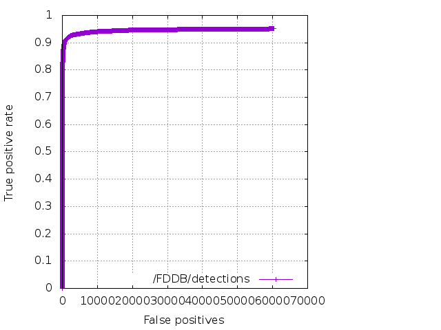
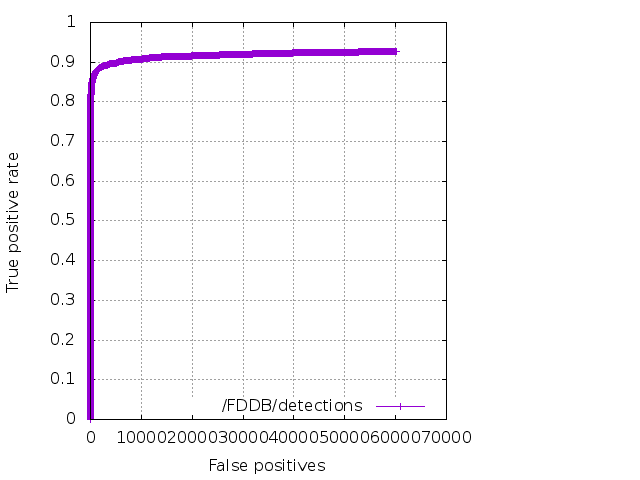

# Face detection using YOLOv2

This demo shows 2 face detectors:

1) OpenCVs Viola Jones implementation (red)
2) YOLOv2 trained on the WIDER FACE dataset (green)

It's using  [OpenCV's dnn module for YOLO inference](https://github.com/opencv/opencv/pull/9705).
Check out the video below:

## Training

There are 2 trained models: one based on YOLOv2 and other on Tiny YOLO. Both using convolutional weights that are pre-trained on Imagenet: 
[darknet19_448.conv.23](https://pjreddie.com/media/files/darknet19_448.conv.23).

The [Widerface](http://mmlab.ie.cuhk.edu.hk/projects/WIDERFace/) dataset was used for training - [morghulis](https://github.com/the-house-of-black-and-white/morghulis) was used to 
download and convert it to a darknet friendly format.

Use the links in the table below to download the `.weights` and `.cfg` files used for training.

Model | Train | Test | mAP | IoU | cfg/weights
---: | ---: | ---: | ---: | ---: | ---:
YOLOv2 | [Widerface](http://mmlab.ie.cuhk.edu.hk/projects/WIDERFace/) | [FDDB](http://vis-www.cs.umass.edu/fddb/) | ? | 64.23 | [link](https://drive.google.com/open?id=1_Uj59hkJEpht2ykZphW4m-l42odwkPJB)
Tiny YOLO | [Widerface](http://mmlab.ie.cuhk.edu.hk/projects/WIDERFace/) | [FDDB](http://vis-www.cs.umass.edu/fddb/) | ? | 60.16 |  [link](https://drive.google.com/open?id=1koNNZv53JXzcgP_5sPMUVlAnB7HW8uLc)

## Face detection performance evaluation on the FDDB dataset

### Continuous ROC

YOLO | Tiny YOLO 
:---: | :---: | 
 | 

### Discrete ROC

YOLO | Tiny YOLO 
:---: | :---: | 
 | 

 

    
