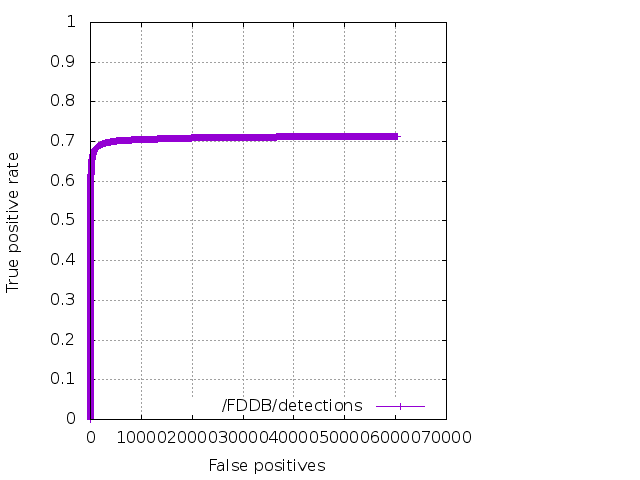
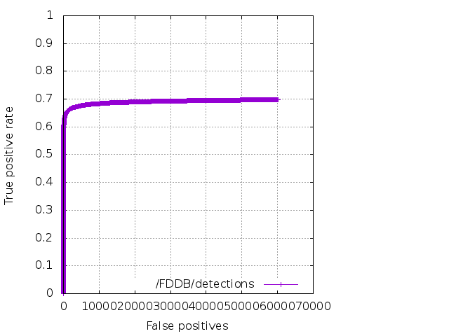

# Face detection using YOLO

Model | Train | Test | mAP | IoU | cfg/weights
---: | ---: | ---: | ---: | ---: | ---:
YOLOv2 | [Widerface](http://mmlab.ie.cuhk.edu.hk/projects/WIDERFace/) | [FDDB](http://vis-www.cs.umass.edu/fddb/) | ? | 64.23 | [link](https://drive.google.com/open?id=1_Uj59hkJEpht2ykZphW4m-l42odwkPJB)
Tiny Yolo | [Widerface](http://mmlab.ie.cuhk.edu.hk/projects/WIDERFace/) | [FDDB](http://vis-www.cs.umass.edu/fddb/) | ? | 60.16 |  [link](https://drive.google.com/open?id=1koNNZv53JXzcgP_5sPMUVlAnB7HW8uLc)

## Face detection performance evaluation on the FDDB dataset

[]

[] 

    
