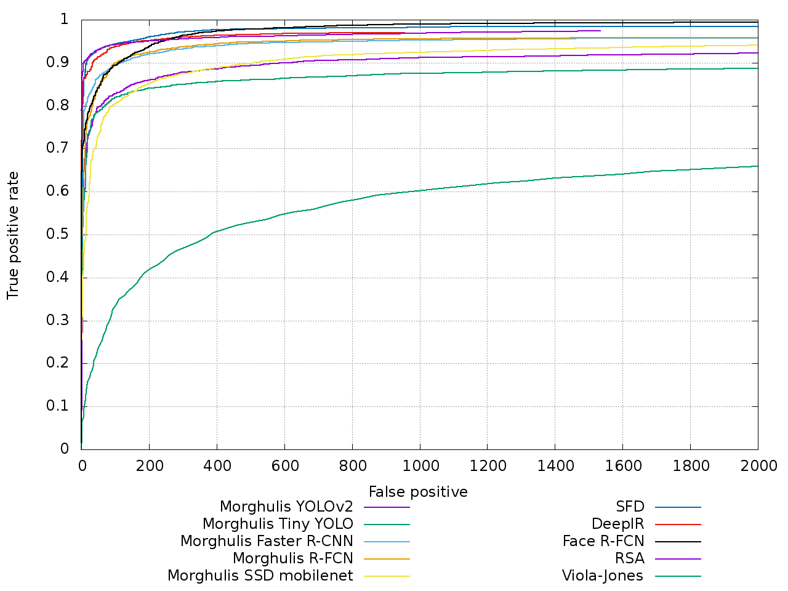
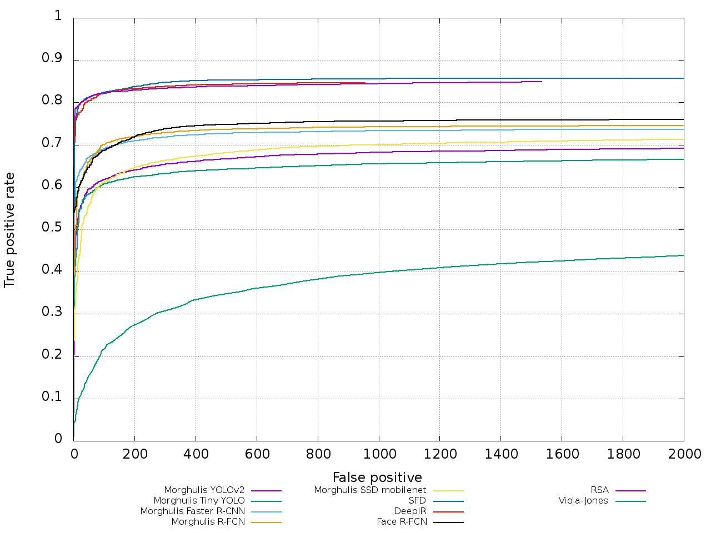

# Face detection model zoo

 

A collection of face detection models pre-trained on the [Widerface](http://mmlab.ie.cuhk.edu.hk/projects/WIDERFace/) 
dataset. 
In the table below you can see each model detailed information including:

* a model name
* a download link to a `tar.gz` file containing the model and configuration files
* TODO model speed
* detector performance measured on the [FDDB](http://vis-www.cs.umass.edu/fddb/) benchmark

Model | mAP@0.5 | cfg/weights
--- | ---: | :---:
YOLOv2 | 84.90 |[link](https://drive.google.com/open?id=1_Uj59hkJEpht2ykZphW4m-l42odwkPJB)
Tiny YOLO | 80.04 |[link](https://drive.google.com/open?id=1koNNZv53JXzcgP_5sPMUVlAnB7HW8uLc)
SSD mobilenet v1 | ? |[link](https://drive.google.com/open?id=1NT3PLBHa4cYj_RmKlRrCZSWMKMct2-26)
Faster RCNN inception resnet v2 atrous | 94.39 |[link](https://drive.google.com/open?id=1bMdKHMcVidrG7BUvoIk6cCcEGKhBFvcc)
R-FCN resnet101 | 94.73 |[link](https://drive.google.com/open?id=1is7Ldv9ASYNcrv2GyXS7EaV58UaqhuFQ)

## Training details

[Morghulis](https://github.com/the-house-of-black-and-white/morghulis) was used to 
download and convert it to either [Darknet](https://pjreddie.com/darknet/yolo/) or [Tensorflow Object Detection API](https://github.com/tensorflow/models/tree/master/research/object_detection) format.

### Darknet

There are 2 models trained with [Darknet](https://pjreddie.com/darknet/yolo/): one based on YOLOv2 and other 
on Tiny YOLO. Both used convolutional weights that are pre-trained on Imagenet: 
[darknet19_448.conv.23](https://pjreddie.com/media/files/darknet19_448.conv.23).

### Tensorflow Object Detection API

The remaining models were trained with [Tensorflow Object Detection API](https://github.com/tensorflow/models/tree/master/research/object_detection) 
on [Google Cloud ML Engine](https://cloud.google.com/ml-engine/docs/technical-overview).

## Face detectors performance **evaluation** on the FDDB dataset

### Discrete ROC

 

### Continuous ROC

 

